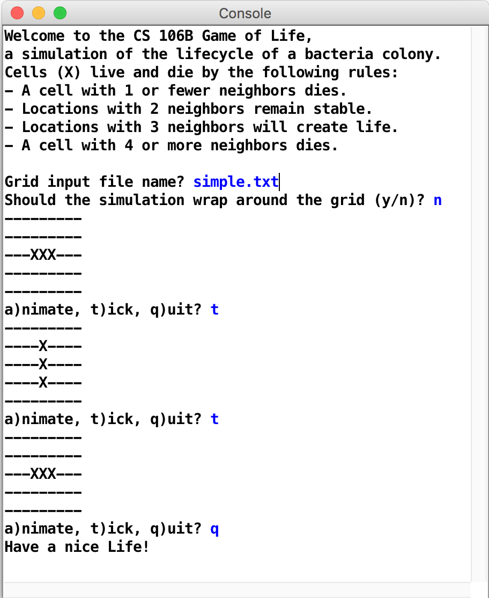

For your first assignment... We make the Game of Life!

The purpose of this assignment is to gain **familiarity** **with basic C++ features** such as functions, strings, and I/O streams, using provided libraries, and decomposing a large problem into smaller functions.


## Overview

1. should begin by prompting the user for a file name and using that file's contents to set the initial state of your bacterial colony grid.
2.  should ask if the simulation should wrap around the grid (see below for the details of wrapping).  wrap around means that boarders connect like in Karnaugh map.
3.   the program will allow the user to advance the colony through generations of growth. The user can type t to "tick" forward the bacteria simulation by one generation, or a to begin an animation loop that ticks forward the simulation by several generations, once every 50 milliseconds; or q to quit
4.   Your menu should be case-insensitive; for example, an uppercase or lowercase A, T, or Q should work (hint: you can use the toLowercase() function to convert a string to lowercase).



# Files 
1. life.cpp
2. mycolony.txt


# Rules
defining neighbors 
- wrapping or not --> corner cells
- zero or 1 neighbor --> cell die
- two neighbor --> maintain
- three neighbor --> generate
- four or more --> empty

Any changes (births or deaths) in a given generation k start to have effect on other neighboring cells in generation k+1.

# Input
i.e. simple.txt
```
5                   ← number of rows tall
9                   ← number of columns wide
---------
---------           ← - is a dead cell
---XXX---           ← X is a living cell
---------
---------
```

# Implementation Details
Grid: The grid of bacterial cells could be stored in a 2-dimensional array, but arrays in C++ lack some features and are generally difficult for new students to use. They do not know their own length, they cause strange bugs if you try to index out of the bounds of the array, and they require understanding C++ topics such as pointers and memory allocation. So instead of using an array to represent your grid, you will use an object of the Grid class, which is part of the provided Stanford C++ library.

Your main function should create your Grid and pass it to the other functions. Since it is expensive to make copies of a Grid, if your code passes a Grid object as a parameter from one function to another, it should always do so by reference (Grid&, not Grid). See the lecture notes for examples. Since you don't know the size of the grid until you read the input file, you can call resize on the Grid object once you know the proper size.

整体框架可以参看之前的game show lectur3

Make sure to close your input file streams when you are done reading the given file: stream.close().

检查输入正确性
fileExists(string &fileName)
暂停以及清零pause(ms) clearConsole()

# wrapping
logic for this is not too difficult, and you may want to use the remainder operator (%) to perform part of this task. The remainder function works as follows:
(a % b) returns the remainder of a / b

consider a n+1 grid with the outer range

# Development Strategy and Hints:
not a complete code but a small functional part every step
1. basic project running: introductory and welcome messege
2. file input: code to prompt for a filename, open and print the file's lines to console. then reading individual grid cells and turn into Grid object. print Grid's state to console using toString to see if it has right data. simple test case is needed, e.g. simple.txt  (checked
3. Grid display. write code to print current state without modifying (checked)
4. updating to next generation. one of the hardest part.
5. overall menu and animation. implement main menu and the animation feature. 

for step.4 updating next state u should have a temporary second grid to store the next one without changing the current one.

HINT:
convert between string and integers
close all running window and rerun in order to solve some errors