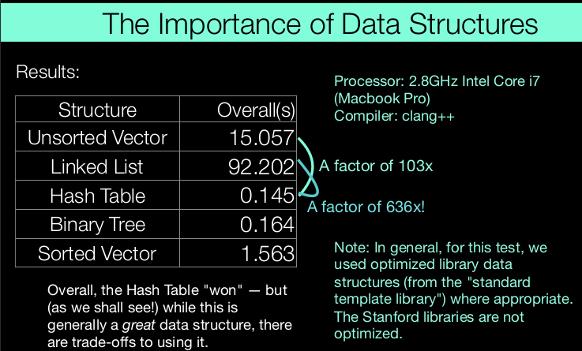

# goals
## Explore common abstractions 
These are all solved with the same abstraction! (using a "graph," which we will learn 
about near the end of the course) 
• By learning common abstractions, we can use those abstractions to solve many 
problems. 
• See the course website to see the list of topics we will cover

## Harness the power of recursion 

## Learn and analyze efficient algorithms

Steps: 
1. Install QT Creator (see Assignment 0!) 
2. Download the example "simple-project": http://web.stanford.edu/
class/cs106b/qtcreator/simple-project.zip
3. Rename the .pro file hello-world.pro
4. Open the src folder, delete hello.h and rename hello.cpp to 
hello-world.cpp
5. Open hello-world.pro
6. Click "Configure Project" 
7. Open Sources->src->hello-world.cpp
8. Delete everything! 
9. Now we're ready to code

code2
data structure

Why are there such discrepancies??
Bottom line:
• Some structures carry more information simply because of their design.
• Manipulating structures takes time

## HW
hw0 tools 
hw1 