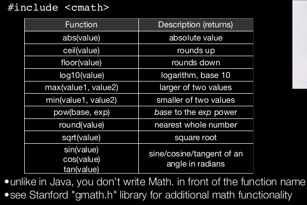

# logistics
- hw1: Game of life 
- input/output in C++
- functions value semantics reference semantics
- intro to computational complexity and bigO
- reading assignment: chapter 2,3 sec10.2

## hw1
•The program you write will utilize:
•Functions
•Constants
•Loops
•I/O (cout, getLine(), getInteger())
•Reference semantics, Value semantics
•Strings
•Logic
•Cellular Automation

## input and output 
use StanforLib $getLine getline getInteger$
read from file: getline
filelib.h


## function
语法: c++函数和java函数类似 生命线同 但是没有public keyword in front
一定有返回类型 
```cpp
double square(double x); // returns a double
Vector<int> matrixMath(int x, int y); // returns a Vector
// probably not a good
// idea! (covered later)
string lowercase(string s); // returns a string (maybe
// not a good idea...
void printResult(Vector<int> &v); // returns nothing!
```
与python不同 一次只能返回一种类型 
例子
```cpp
#include <iostream>
#include "console.h"

using namespace std;
const string DRINK_TYPE = "Coke";
// Function Definition and Code
void bottles(int count) {
cout << count << " bottles of " << DRINK_TYPE << " on the wall." << endl;
cout << count << " bottles of " << DRINK_TYPE << "." << endl;
cout << "Take one down, pass it around, "
<< (count-1) << " bottles of " << DRINK_TYPE
<< " on the wall." << endl << endl;
}
int main() {
for (int i=99; i > 0; i--) {
bottles(i);
}
return 0;
}
```

### builtin function cmath



## value semantics

