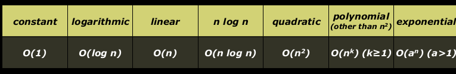

# logistics
- hw1: Game of life 
- input/output in C++
- functions value semantics reference semantics
- intro to computational complexity and bigO
- reading assignment: chapter 2,3 sec10.2

## hw1
•The program you write will utilize:
•Functions
•Constants
•Loops
•I/O (cout, getLine(), getInteger())
•Reference semantics, Value semantics
•Strings
•Logic
•Cellular Automation

## input and output 
use StanforLib $getLine getline getInteger$
read from file: getline
filelib.h


## function
语法: c++函数和java函数类似 生命线同 但是没有public keyword in front
一定有返回类型 
```cpp
double square(double x); // returns a double
Vector<int> matrixMath(int x, int y); // returns a Vector
// probably not a good
// idea! (covered later)
string lowercase(string s); // returns a string (maybe
// not a good idea...
void printResult(Vector<int> &v); // returns nothing!
```
与python不同 一次只能返回一种类型 
例子
```cpp
#include <iostream>
#include "console.h"

using namespace std;
const string DRINK_TYPE = "Coke";
// Function Definition and Code
void bottles(int count) {
cout << count << " bottles of " << DRINK_TYPE << " on the wall." << endl;
cout << count << " bottles of " << DRINK_TYPE << "." << endl;
cout << "Take one down, pass it around, "
<< (count-1) << " bottles of " << DRINK_TYPE
<< " on the wall." << endl << endl;
}
int main() {
for (int i=99; i > 0; i--) {
bottles(i);
}
return 0;
}
```

### builtin function cmath


## value semantics
变量传递是值传递 不会改变本身

## reference semantics
declare a parameter with an & after its type
link the caller and callee to the same variable in memory

referecnes can be confusing as the ampersand character is also used to specify variable or object.
the & 只有在声明函数的时候是引用传递 
而不是调用打时候

引用传递打好处/坏处
同时"return" more than one value
防止多次传递

坏处:调用的时候看不出来是咋样[看这个](./valuesemantics.cpp)
稍微慢一点点 
没法在引用传递 直接传值进去 grow_refer(39) -->wrong

### how do we return multiple things

```c
/*
* Solves a quadratic equation ax^2 + bx + c = 0,
* storing the results in output parameters root1 and root2.
* Assumes that the given equation has two real roots.
*/
void quadratic(double a, double b, double c,
double& root1, double& root2) {
double d = sqrt(b * b - 4 * a * c);
root1 = (-b + d) / (2 * a);
root2 = (-b - d) / (2 * a);
}
```
how to return? reference
还有什么方法
Possible choices:
•We could have returned a boolean if the roots were imaginary
•We could have added extra parameters to support some form of imaginary numbers
•We could have called an error function inside this function (but that is not
always a good idea -- functions like this should generally have an
interface through the parameters and/or return value, and should
gracefully fail)
•We could have re-written the function as two functions that
return either the positive or negative root, without using
references.
•We could have returned a Vector<double> object (tricky syntax!)


## computational complexity
```c
int vectorMax(Vector<int> &v){
    int currentMax = v[0];
    int n = v.size();
    for (int i=1; i < n; i++){
        if (currentMax < v[i]) {
            currentMax = v[i];
        }
    }
    return currentMax;
}
```
why is n important to this function

way1: for assembly code, count down the time consumption
way2: count the steps in source code


Wikipedia:
“Big-O notation describes the limiting behavior of a function when
the argument tends towards a particular value or infinity, usually in terms of simpler functions.”



When you are deciding what Big-O is for an algorithm or function,
simplify until you reach one of these functions, and you will have
your answer.

now we are back to vectorMAx()
    always worst case.
    ignore primitive operand


so ignore the original two variable initializations, the return
statement, the comparison, and the setting of currentMax in the loop.
        for (int i=1;i<n;i++>)
therefore O(n)

in [lectureCode](./allCodeLecture2/code/asymptotic/)