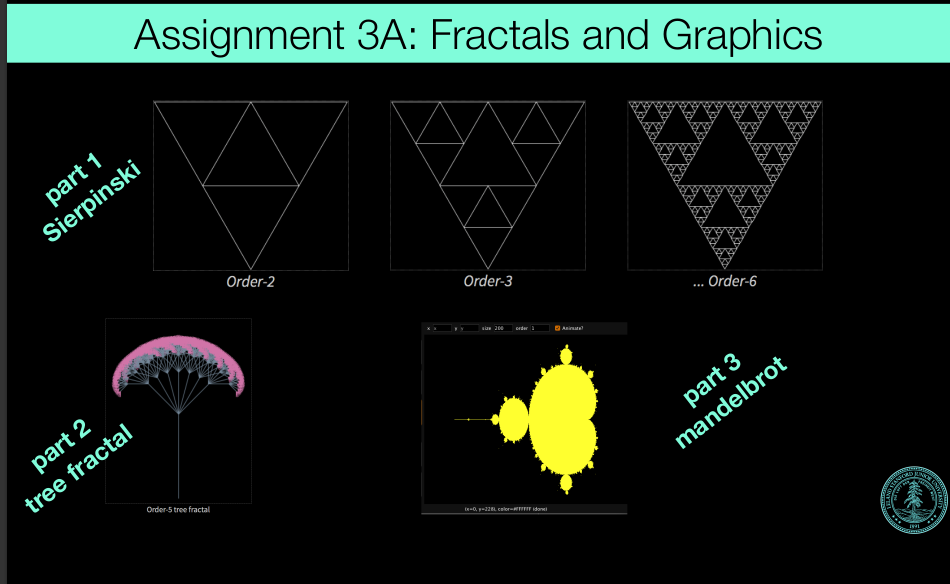

# fractals 分形
• Logistics:
• ADTs Due Thursday April 20th, noon
• Towers of Hanoi video featuring Keith Schwartz: https://www.youtube.com/watch?v=2SUvWfNJSsM
• Tiny Feedback
• Assignment 3: Recursion
• Fractals
• Grammar Solver
• A more detailed recursion example
• Fractals

## Assignment 3: Recursion
(1) Fractals and Graphics
(2) Grammar Solver

Assignment 3B: Grammar Solver
write a function for generating random
sentences from a grammar.
example describing a small subset of the English language. Non-
terminal names such as <s>, <np> and <tv> are short for linguistic
elements such as sentences, noun phrases, and transitive verbs:
<s>::=<np> <vp>
<np>::=<dp> <adjp> <n>|<pn>
<dp>::=the|a
<adjp>::=<adj>|<adj> <adjp>
<adj>::=big|fat|green|wonderful|faulty|subliminal|pretentious
<n>::=dog|cat|man|university|father|mother|child|television
<pn>::=John|Jane|Sally|Spot|Fred|Elmo
<vp>::=<tv> <np>|<iv>
<tv>::=hit|honored|kissed|helped
<iv>::=died|collapsed|laughed|wept

## challenge: implement of recursion function solving expression "((1+3)*(2*(4+1)))"

since we only need to deal with * and +, the expression is always one of three cases, number/expression*expression/expression+expression

int evaluation(string exp){
    //"((1*3)+(4+2))"
}
