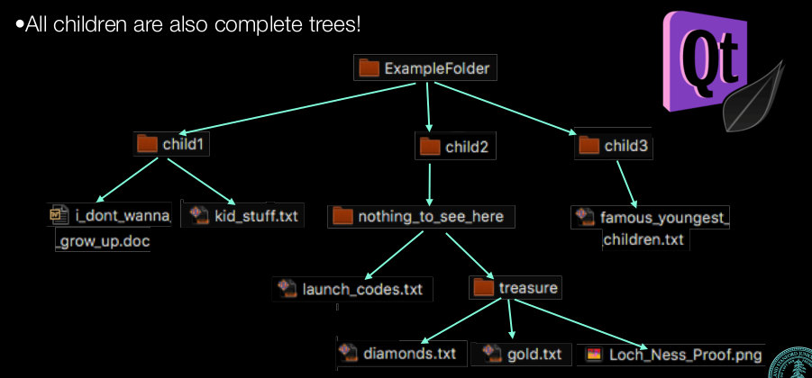

# recursion and decision trees
- folders and directories
- reducible words

exhaustive search
permutation

## more recursion
```c

long factorial(long n){
    long ans=1;
    while(n>1){
        ans*=n;
        n--;
    }
    return ans;
}
```
thest recursion is nothing special
## iterative branching
folder is a tree!


check qt project


five basic points of recursive usage
- determine whether a solution exists
- find a solution
- find the best solution
- count the number of solutions 
- find all solutions

## Jumble

permutation game: different length use different depth of for loop is not tenable

so instead we use a recursion, for we don't care about all iterative pattern, just rearrange


## in total,
the tree here we call is not a datatype, just  a tree of data.
