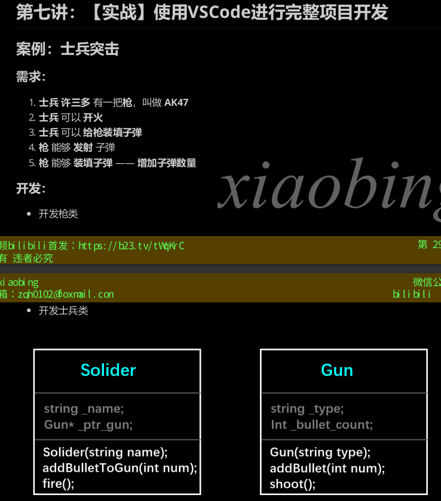

# 使用vscode开发c/cpp环境linux配置教程
## 第一章 linux篇
- 目录结构
  bin 可以运行的文件 dev 外设 home 家文件 etc 存储一些配置文件 proc 进程运行时的 root 管理员的家目录 
  sbin  tmp临时 usr unix system resource var系统/程序的日志 mnt外设挂载

## 第二章 开发环境搭建
- 安装gcc gdb
  ```
    sudo apt update
    # 通过以下命令安装编译器和调试器
    sudo apt install build-essential gdb
    ```
- 安装成功确认
    ```
    gcc --version
    g++ --version
    gdb --version
    ```
- CMake安装
    ``sudo apt install cmake``
    ``cmake --version``
## 第三章 gcc编译器
支持范围
>前言：
    1. GCC 编译器支持编译 Go、Objective-C，Objective-C ++，Fortran，Ada，D 和 BRIG（HSAIL）
    等程序；
    2. Linux 开发C/C++ 一定要熟悉 GCC
    3. VSCode是通过调用GCC编译器来实现C/C++的编译工作的；
- 过程
>
1. 预处理-Pre-Processing //.i文件
```
# -E 选项指示编译器仅对输入文件进行预处理
g++-E test.cpp -o test.i //.i文件
```
2. 编译-Compiling // .s文件
```
# -S 编译选项告诉 g++ 在为 C++ 代码产生了汇编语言文件后停止编译
#g++产生的汇编语言文件的缺省扩展名是 .s
g++ -S test.i -o test.s
```
3. 汇编-Assembling // .o文件
```
# -c 选项告诉 g++ 仅把源代码编译为机器语言的目标代码
# 缺省时 g++ 建立的目标代码文件有一个 .o 的扩展名。
g++ -c test.s-o test.o
```
4. 链接-Linking // bin文件
```
# -o 编译选项来为将产生的可执行文件用指定的文件名
g++ test.o -o test
```
- 编译重要参数
-g 带调试信息的可执行文件
-O 优化源代码 -O0不优化 1为默认优化 2指令调整 3包括循环展开等优化 
带-O编译速度变慢 但文件运行会便快
-l -L 指定库 制定库路径 
指定库时 需要在**/lib /usr/lib /usr/local/lib**三个文件夹内
    ```
    # 链接glog库
    g++ -lglog test.cpp
    ```
    通过-L指定目录
    ```
    # 链接mytest库，libmytest.so在/home/bing/mytestlibfolder目录下
    g++ -L/home/bing/mytestlibfolder -lmytest test.cpp
    ```
  -I 指定头文件搜索目录
  如果头文件不再/usr/include目录下,就需要加上头文件的位置 紧跟在-I后
  ``g++ -I/myinclude test.cpp``
  -Wall 打印警告信息
  ``g++ -Wall test.cpp``
  -w 关闭警告信息
  -std=c++11 设置编译标准 使用c++11编译
  -o 输出文件名
  -D定义宏
  常用于-DDEBUG 在测试代码中如果出现啦``#ifdef DEBUG``此时会被执行
- 实战
在 3.gccbuild文件夹中存在的结构
    ```
    1# 最初目录结构
        
    3├── include
    4│
    5├── main.cpp
    6└── src
        └── Swap.h
        └── Swap.cpp
    8
    9
    2 directories, 3 files
    ```
方法1.直接编译 文件夹为``3.gccbuild``
通过-I实现引入头文件
```
# 将 main.cpp src/Swap.cpp 编译为可执行文件
g++ main.cpp src/Swap.cpp -Iinclude
# 运行a.out
./a.out
```
通过-I参数将头文件导入 
方法2.增加编译参数 
```
# 将 main.cpp src/Swap.cpp 编译为可执行文件 附带参数
g++ main.cpp src/Swap.cpp -Iinclude -std=c++11 -o2 -wall -o b.out
# 运行b.out
./b.out
```
方法3.生成静态库文件并编译
静态库的产生本质上是一个归导,需要先生成.o文件,然后使用ar命令
```
cd src
#生成.o文件
g++ swap.cpp -c -I../include
#生成静态链接库 静态库文件一般为.a
ar rs libswap.a swap.o
cd ..
#链接 生成可执行文件staticmian
g++ main.cpp -Iinclude -Lsrc -lswap -o staticmain
```
在上命令中 执行的顺序为 -lswap 等价与导入libswap.a 但是要去src目录下找, 所以-Lsrc 
方法4.生成动态链接库文件
```
cd src
#生成动态链接库libswap.so
g++ swap.cpp -I../include -fPIC -shared -o libswap.so
#等价与 gcc swap.cpp -I../include -c -fPIC 
# gcc -shared -o libswap.so swap.o

cd..
#链接 生成可执行文件sharemain
g++ main.cpp -Iinclude -Lsrc -lswap -o sharemain
```
-shared 动态库
-fPIC position independent code 不加-fPIC编译出来的.so要在加载的时候再次重定位,无法真正共享
但此时在执行的时候 直接执行是会报错的
因为动态库不在这个目录下,需要通过加入,然后马上执行``LD_LIBRARY_PATH = src ./sharemain``

## 第四章 odb调试器
GDB GNU Debugger 是linux环境最常用的调试器,vscode的调试功能
主要功能 设置断点 查看变量 动态改变执行环境 分析崩溃产生的core文件
gdb有很多的命令 首先使用vscode进行调试 代码如4.gdbtest
需要注意的是 编译的时候带上-g gcc -g main.cpp -o main 否则不能使用gdb调试


## 第五章 VSCode IDE
两个实例
在5.1 folder中, 对单一文件进行了简单打g++命令
在5.2 中, 完成了前面编译用到swap的编写 一个类{头文件 cpp 执行文件cpp}
编译 g++ main.cpp src/main.cpp -Iinclude -o main
F2变量重命名 minimap
## 第六章 CMake  
1. 介绍
简单项目写makefile 复杂项目用cmake
cmake 跨平台
2. 语法
参数在括号内 空格或；为分隔符
指令大小写无关
使用${}取变量的值, 但是在if语句中直接使用变量名

3. 指令和变量
3.1 指令
cmake_minimum_required(VERSION xx)

project (__name__) 定义工程名称和语言

set(valName val) 定义变量
i.e. ``set({SRC} hello.cpp print.cpp)``
include_directories(dir1 dir2) 定义头文件搜索路径 -I

link_directories(dir1 dir2) 定义库文件搜索路径 -L

add_library(libname SHARED|STATIC|MODULE source) 生成库文件
i.e ``add_library(hello SHARED ${SRC})``

add_compile_options 添加编译参数
i.e. ``add_compile_options(-Wall -std=c++11 -o2)``

add_executabel（exename src1 src2) 生成可执行文件
i.e. ``add_executabel(main main.cpp)``

target_link_libraries(target lib1 lib2)为目标链接共享库 -l
i.e.``target_link_libraries(main hello)``

add_subdirectory(sourcedir bin_dir) 为工程添加存放源的子目录
i.e. ``add_subdirectory(src)`` **这个文件夹要有一个CmakeLists.txt**

aux_source_dictory(dir VAR) 发现目录下的所有源代码并将列表存储在变量
用于自动构建源文件列表
i.e. ``aux_source_dictory(. SRC)`` 将当前目录所有文件存在变量

3.2 变量
CMAKE_CXX_FLAGS g++编译选项
``set(CMAKE_CXX_FLAGS "${CMAKE_CXX_FLAGS} -std=c++11")``
CMAKE_BUILD_TYPE 编译类型
``set(CMAKE_BUILD_TYPE Debug|Release)
CMAKE_CXX_COMPLIER 指定编译器
关于路径 CMAKE_BINARY_DIR CMAKE_SOURCE_DIR
EXECUTABLE_OUTPUT_PATH 可执行文件输出位置
LIBRARY_OUTPUT_PATH 库文件输出位置


4. 编译工程
项目主目录存在一个CMakeLists.txt文件
如果包含源文件的子文件夹不包含CMakeLists, 子目录的编译规则在主目录
若包含 需要通过add_subdirectory添加即可

- 编译流程
编写CMakeLists
执行命令cmake PATH 生成Makefile 
使用make进行编译

- 两中构建方式
内部构建 所有文件放在一起 不推荐
外部构建 输出文件与源文件不放在一个目录
```
mkdir build
cd build 
cmake ..
make
```


5. 项目实战
对5.vscode文件夹中的内容进行完善 使用cmake进行编译
第一个实战 对5.1 hello 

第二个实战 
## 第七章 实战 利用vscode进行完整开发

先开发包含在士兵类的枪类

7.1 合理设置项目结构
src include main
分别写类的定义和实现
7.2 编写程序
见文件夹
7.3 编写cmakelists
与使用g++命令对比
g++ main.cpp src/Gun.cpp src/solider.cpp -Iinlcude -o exe
-Wall -g -o2
7.4 手动编译cmake

7.5 配置vscode的json调试文件

