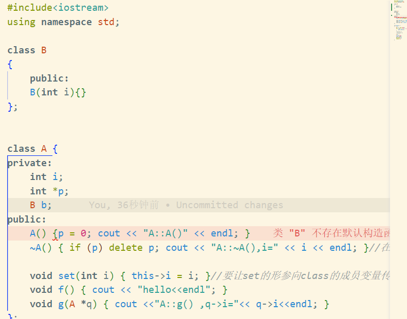
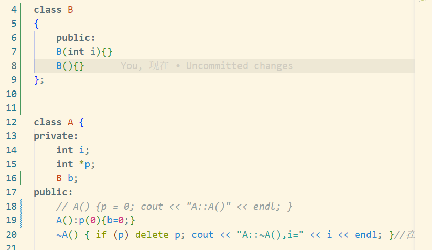
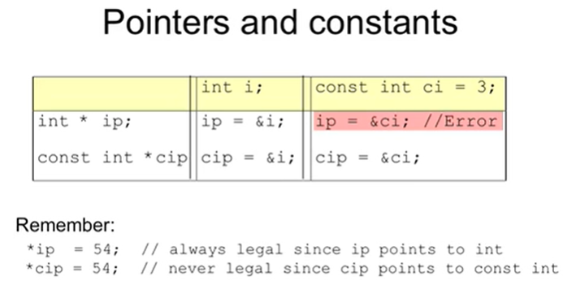
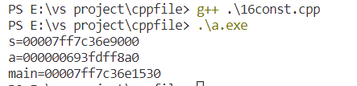
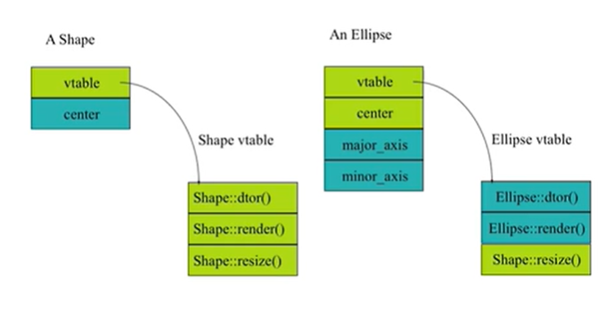
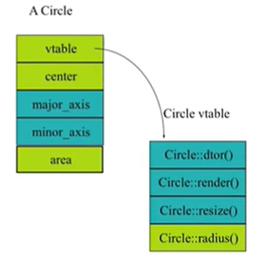

# 笔记
1. cpp的程序在编译的过程中都会被翻译成c，其中的程序名会被加上下划线 structure和class都可以定义类
2. declaration definition 在编译的过程中，一个cpp文件是一个编译的单元，每次以一个单元为核心进行编译，于是当重复的定义发生时候会报错， 未声明的定义会报错。
```
#ifndef _name_h
#define _name_h
...
#endif
```
3. 声明在.h文件中进行包括：
   1. extern variables
   2. function prototypes
   3. class/struct decalration
4. 从对象的角度看问题 就是从内容的角度 以时钟程序为例
   11：03 前两位和后两位 并且有一定的相似
   >mydisplay:ClockDisplay-->NumberDisplay11 NumberDisplay03


5. 成员变量 local本地变量，存在在函数里。在成员函数里 命名相同的变量以本地变量为准。由于成员变量写在类的声明里，成员变量的位置：成员变量不在类里面，在类中进行了声明，但是在构造时候赋值，此时在main函数中的对象里，出现了成员变量。
   但函数是属于类的，不属于对象。
   this的作用 this是一个指针 ``printf("this=%p\n",this)``所有的成员变量前面都有一个this->
6. 构造和析构 C++与java不同，java在添加成员的时候会将对象初始化，c++要自己写
   constuctor 名字和类的名称相同，没有返回值，会在对象创建的时候自动运行 可以传参数
   析构函数 ~类的名字 没有参数
7. 对象初始化 default constructor 没有缺省参数的就是 初始化的错误， 
8. new and delete new用来制造一个对象 类似于c的malloc free 
   delete p; delete[] p; new带括号 则delete带
   动态申请空间 int * psome=new int [10]; delete[] psome;
   在申请的空间较小的时候 并不涉及操作系统。
   new的时候 表上记录 地址 大小。所以不要用delete释放不是new的。
   但delete null是安全的
   当int *a=new int[10]; a++; delete[] a;这时候会找不到a
   new了不delete 内存泄漏。
9. 访问限制 private和public protected自己和子孙
    同一个类的对象中间可以访问私有的变量 private的检查只限于编译时刻。在运行的时候，可以访问私有的。他的.o完全丧失了cpp的特性，只要有办法。只是对类的
    友元friends 让可以访问私有 在**运算符的重载**有用
    在**class**中， 缺省的访问属性就是**private** **struct**则为**public**
10. 初始化列表initializer list 在构造函数后面加上成员变量的初始值
    ```c_cpp
    class Point{
      private:
      const float x,y;
      Point(float xa=0.0, float ya=0.0):y(ya),x(xa){};
    };
    ```
    可以初始化任何类型的变量，并且此时变量的初始化早于构造函数的执行
    这一点当类的成员是对象，这一点会产生很大的区别
    ```c_cpp
    //initailization before constructor
      Student::Student(string s):name(s){}

      //assignment
      Student::Student(string s){name=s;}
    ```
    **所有变量在初始化列表进行初始化**
    
    
11. 软件重用 组合reusing the implementation 
    composition **[$10 11见initalization那个文件$](./initializationVassign.cpp)**
    * by other objects: inclusion
      * fully: 成员变量是对象本身
      * reference: allow sharing 成员变量是指针 在外面
    * 当成员变量是其他的类的时候 初始化列表要给出其构造函数并给出相应参数完成初始化
12. 继承[inheritance](./inheritance.cpp) 用一个类改一改成为新类。与组合不同，用几个对象拼接
    继承是没有实体的，组合一定有实体
    分享了
    * member data //一般时private
    * member func//protected 给子类留的可以访问private的接口
    * interface//一个类公开的部分
   父类的私有不能被直接访问 除了protected
13. 父类子类关系 std::string& 类的全名 类属于某个命名空间.
    当我们构造子类的对象时，会调用父类的默认构造函数，若不存在会报错[见$inheritance$](./inheritance.cpp)
    当我的构造函数不是默认构造函数的时候，不能在构造函数里送参数进去
    **父类的参数也必须通过初始化列表完成，顺序是先父类，然后依次**
      * 此时，父类先构造，然后构造子类， 析构的时候子类先被析构
   ::解析符 子类访问父类的变量
   当子类中和父类有相同的成员函数，不会重载，父类的函数都会看不见 隐藏了
   并且， 这个同样的函数，子类的和父类的关系，只能使用解析符
14. 重构overloading 同名函数参数表一定不一样，返回类型不能区分
    预先给一个值，缺省参数，这个在函数原型里面 也就是h文件中实现。cpp中不能使用 原理就是default argument是编译的时候贴进来的，所以声明的时候很重要
    **尽量少写default value，难以阅读**
15. overhead 额外开销 for a func to be called
    由于c不支持重载，c++在转汇编的时候会改名字
    在程序运行的过程 
    * push params
    * push return addr
    * prepare return values
    * pop all pushed

   关键词 inline 不是去调用函数，而是把对应的代码嵌入到调用的地方
   inline函数写法：必须在声明定义都放inline，如果少了会没有贴
   .h ``inline int plusOne(int x);``
   .cpp ``inline int plusOne(int x) {return x++;};``
   inline函数的 精髓是，要在调用的时候知道长什么样子，全部内容放到.h就完事了
   加了inline 表明函数不是definition 而是declearation
   以空间换时间,但是比宏定义要安全
   ```c_cpp
   #define f(a) a+a
   main(){
      double a=5;
      printf("%d",f(a));
   }
   ```
   ```c_cpp
   inline int f(int i){return 2*i;}
   main(){
      double i=5;
      printf("%d",f(i));//这里会做类型检查
   }
   ```
   如果inline出现递归,则编译器不会使用inline
   成员函数,如果在声明的时候给出inline 统统都是[inline示例](./inlinemember.cpp)
   更加整洁的做法时在下方给出定义,使用inline关键字 [示例](13employee.cpp)
   建议:两三行,频繁调用的函数
   递归的 超过20行的不要inline

16. const i.e.``const int x=123;``则x的值不可以被修改
    但是,对于c++而言 这个变量仍然时变量 编译器会给他分配内存 不是一个常数
    对于变量的声明时,就需要给值,除非是 ``extern const int x;``
    这个本身不是由机制保证的,是编译器不允许修改
   在编译的时候发生的粘贴, 如果不知道const的值, 会报错 i.e.
   ```
   int x; cin>>x;
   const int size=x;
   double classAverage[size];//error
   ```
   同理,前面的extern声明的x, 如果没有被定义, 也不能放到上面去构造数组
   因为编译器无法根据这个大小给数组分配内存
   **指针const**
   - 指针本身是const, 本身无法被修改
   ``char * const q="abc";`` q是const;q++是不可以的,但是所指的内存是可以变得
   *q='c';//ok q++//error
   
   - 所指向的对象是const
   ``const char *p='abc';``*p是const 所指的内存是const, 意思是不能通过p修改我对应的内存单元, 而不是说p指的地方就变成const
   *p='c';//error p++ //ok

   三种表示的意义:``Person p1("Fred",20);``
   ```
   const Person* p=&p1;//对象时const 他所指的变量不能通过他修改的指针
   Person const*p=&p1;//对象时const 
   Person *const p=&p1;//指针是const
   ```
   写在星号前面则对象是const 在星号后面指针是const
   const person *const p//两个都是const
   
   在[16const](16const.cpp)中, 虽然指针没给到const, 但是字符串在堆栈的代码段, 代码段本身不可写, 不可更改.可见s在代码段,数组a不在
   
   **如果一个函数的参数是``const int* x``则意味着可以接受任何类型的int, 并且我不会对你传给我的数据进行修改**
   i.e.
   ```
   void f(const int *x);
   int a =15;
   f(&a);//ok
   const int b=a;//ok
   f(&b);//ok
   b=a+1;//error
   ```
   $地址传递:$ 整个object的传递耗费很大, 通常直接操作地址, 但是这样很可能会改变object本身, 不够safe. 所以在函数之间的地址传递 通常使用const
   **对象const**[此时可以回看employee, 包括了内连](13employee.cpp)
   如果一个对象被const修饰, 很可能出问题, 因为他的成员函数可能会修改变量
   所以, 需要知道哪些函数不会修改成员变量的值: 在一些函数的后面加上const,保证着些函数不会修改成员变量的值
   ```
   int Date::set_day(int d){
      day=d;//ok can be modified
   }
   int Date::get_day() const{
      day++;//error
      set_day;//error
      return day;//ok
   }
   ```
   这里 const 被放在函数的后面 其实意味着 this是const
   [示例在这里 只运行了f()const](16constfunc.cpp)
   **成员变量const** 如果没有在initialization list中初始化会报错
   成员变量是const 不能做数组的size 前面提过
   有一种可能时 前面再加一个static 或者用一个枚举 

17. 引用 reference & c++的一种新的数据类型
    $cpp提供的放对象的地方多,堆栈,堆,全局数据区;$
    $ 访问对象的方式多,变量为对象,指针访问对象,引用访问对象$
    一共九种组合
    char c;//character
    char* p=&c;//pointer
    char& r=c;//reference
    又称为别名

    ```c_cpp
    int X=47;
    int& Y=X;
    cout<<"Y="<<Y<<endl;//47
    Y=18;
    cout<<"Y="<<Y<<endl;//18
    ```
    规则:在定义的时候一定要初始化
    ``int &y=x;``
    ``const int& z=x;`` 不能通过z修改x,但是x变了z就变了
    作为函数的参数
    ``void f(int& x);``
    ``f(y)``
    此时在函数里改x,则外面的y会变
    **和指针的区别**,  [示例在这里](./17ref.cpp)
    - 不能为null
    - 在运行的时候不可以改变, 不能被再分配
    - 但ref实际上是使用const* 实现的
  
    所引用的对象一定要有地址
    ```
    void func(int&x);
    func(i*3);//error 这个东西有结果但是没有地址 匿名的临时变量
    ```
    不能再次引用 no ref to ref
    ```
    int x;
    int y;
    int &a=x;
    int& b=a;//error
    int& b=y;
    b=a;// actually y=x;
    ```
    no pointers to reference, but ref to pointer ok
    ```
    int&* p;//ERROR 如果*p时ref, 则可以取到ref的地址了
    int*& p;//ok
    ```
    no array to ref因为ref不是一个实体,就没有数组
    $与java对比, 所有对象放在堆, 只能通过指针访问对象,但叫引用$
    $java的指针不能计算$
18. 向上造型 upcasting 子类对象
    [查看这个对象访问的例子](17ref.cpp)可以通过这个方法去看class里面有什么
    子类的对象当作父类看待 downcast有可能出问题 但是upcast安全
    在[13 employee](13employee.cpp)里面, 出现这个
    ```
    Manager pete("pete","444-55-1236","boss");
    Employee* ep=&pete;//upcast
    Employee& ep=pete;//upcast
    ```
    此时再去调用ep的print则,只是调用了父类的
19. 多态性polymorphism [19shapeclass](19shapeclass.cpp)
    建立在两个基础上:
    - upcast
    - dynamic bonding 函数是virtual的通过指针访问则时动态绑定
  
    实现基础:
    在[19virtualfunc](19shapeclass.cpp)类中,定义了一个虚函数后,发现p所指向的第一个单元不再是第一个成员变量
    所有有virtual的类前面有一个vptr,指向虚函数表, 虚函数表时类的,不会变
    p,q不一样,但是其指向的虚函数表是一样的
    
    仍然保持ellipse的结构但多了自己的resize
    


       

